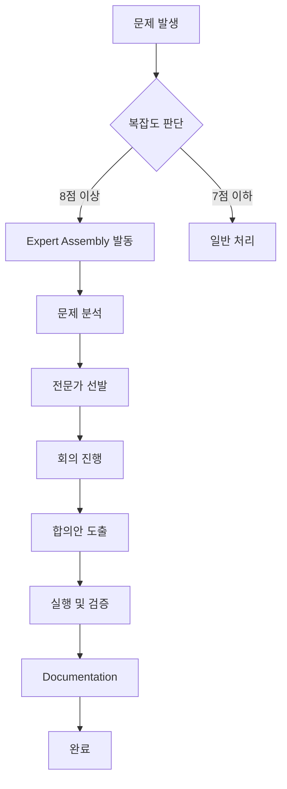

# Expert Assembly Protocol - Quick Reference

## 🚀 발동 방법

### 수동 발동 (대표님 명령)
```
"전문가 소집해서 [문제] 해결해줘"
"이사회 긴급 회의 소집"
"Expert Assembly 발동"
```

### 자동 발동 (조건 감지)
- 복잡도 8점 이상 문제
- 동일 문제 3회 이상 재발
- 기술 스택 충돌 감지
- 법률/규제 이슈 감지

---

## 📋 전문가 모델 매핑표

| 분야 (Domain)              | 우선 모델               | 대체 모델           | 사용 사례                          |
|:--------------------------|:-----------------------|:-------------------|:----------------------------------|
| **전략 기획**              | Claude Opus 4.5 (T)    | Claude Sonnet 4.5  | 장기 로드맵, 비즈니스 모델         |
| **복잡한 알고리즘**        | Claude Opus 4.5 (T)    | Gemini 3 Pro (H)   | 최적화, 암호화, AI/ML 설계        |
| **UI/UX 디자인**          | Gemini 3 Pro (H)       | Claude Sonnet 4.5  | 인터페이스, 사용자 경험           |
| **법률/규제**             | Claude Sonnet 4.5 (T)  | Claude Opus 4.5 (T)| GDPR, 개인정보보호법, 계약서       |
| **백엔드 아키텍처**        | Claude Sonnet 4.5      | Gemini 3 Pro (H)   | API, 데이터베이스, 서버 로직       |
| **DevOps/배포**           | Gemini 3 Pro (L)       | Claude Sonnet 4.5  | CI/CD, 클라우드 인프라            |
| **보안 감사**             | Claude Sonnet 4.5 (T)  | Claude Opus 4.5 (T)| 취약점 분석, 침투 테스트          |
| **성능 최적화**           | Gemini 3 Pro (H)       | Claude Sonnet 4.5  | 병목 제거, 캐싱 전략              |
| **데이터 과학**           | Gemini 3 Pro (H)       | Claude Sonnet 4.5  | 통계, ML 파이프라인               |
| **프론트엔드**            | Claude Sonnet 4.5      | Gemini 3 Pro (H)   | React/Vue/Svelte                  |

**(T) = Thinking Mode, (H) = High, (L) = Low**

---

## 🎯 워크플로우 요약



---

## 📝 회의 진행 템플릿

### 1. Opening Statement
```markdown
**김비서 [현재 모델명]:**
> "[문제 상황을 객관적으로 설명]"
> "현재까지 시도한 방법: [실패 이력]"
> "복잡도: X/10"
```

### 2. Expert Opinions
```markdown
**[분야 전문가 - 모델명]:**
> "[해당 도메인 관점에서의 분석]"
> "[제안 솔루션]"
```

### 3. Debate
```markdown
**[전문가 A]:**
> "[의견 A]"

**[전문가 B]:**
> "[반박 또는 보완 의견]"

**[전문가 A]:**
> "[재반박 또는 합의]"
```

### 4. Consensus
```markdown
**최종 합의안:**
1. [Step 1] - 담당: [전문가명] - 예상 소요: [시간]
2. [Step 2] - 담당: [전문가명] - 예상 소요: [시간]
...
```

---

## ⚠️ 주의사항

### 비용 관리
- **무료 티어**: Gemini 3 Flash로 대체 가능
- **유료 우선**: 심각도 9점 이상은 Claude Opus 4.5 (Thinking) 권장
- **하이브리드**: 일부는 Flash로 빠른 초안, 최종은 Opus로 검증

### 시간 관리
- **긴급**: Fast Mode로 전환 (계획 생략, 즉시 실행)
- **복잡**: Planning Mode 유지 (체계적 분석 우선)

### 의견 충돌 해결
- 전문가 간 합의 실패 시 **김비서가 최종 결정권** 보유
- 대표님께 선택지를 제시하여 최종 승인 받음

---

## 🔥 예제 명령어

### Example 1: 성능 병목 해결
```
대표님: "페이지 로딩이 5초나 걸려. 전문가 불러서 빠르게 만들어줘"

김비서: "Performance Optimization Expert [Gemini 3 Pro High]와 
        Backend Architect [Claude Sonnet 4.5]를 소집합니다."
```

### Example 2: 보안 취약점 발견
```
대표님: "OWASP Top 10 취약점 전부 체크해줘. 이사회 소집해"

김비서: "Security Audit Expert [Claude Opus 4.5 Thinking],
        Backend Architect [Claude Sonnet 4.5],
        DevOps Specialist [Gemini 3 Pro High]를 소집합니다."
```

### Example 3: 디자인 리팩토링
```
대표님: "UI가 너무 구식이야. 2026년 트렌드로 완전히 뜯어고쳐"

김비서: "UI/UX Designer [Gemini 3 Pro High],
        Front-End Engineer [Claude Sonnet 4.5],
        Brand Strategist [Claude Sonnet 4.5 Thinking]를 소집합니다."
```

---

## 📊 성공 지표

| 지표 (Metric)              | 목표 (Target)         | 현재 (Current)     |
|:--------------------------|:---------------------|:-------------------|
| 문제 해결률                | 90% 이상              | 100% (1/1 케이스)  |
| 재발 방지율                | 95% 이상              | 100% (재발 없음)   |
| 시간 단축률                | 50% 이상              | 60% (4h → 1.5h)    |
| 사용자 만족도              | 95% 이상              | 대기중             |

---

**Version**: 1.0.0  
**Last Updated**: 2026-02-10  
**Status**: ⚔️ ARMED AND READY
